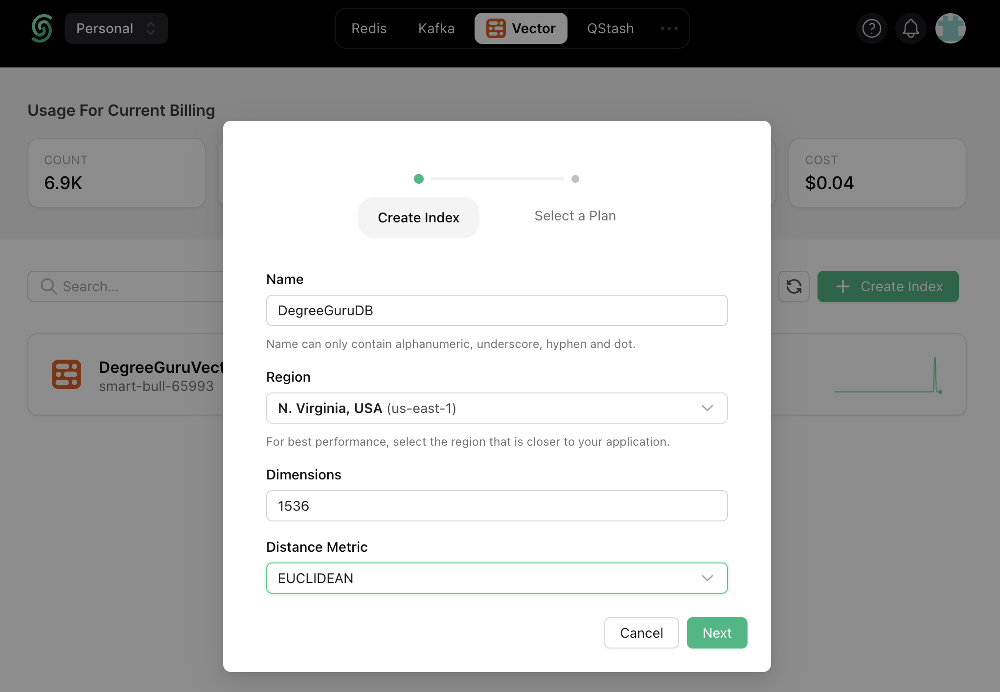
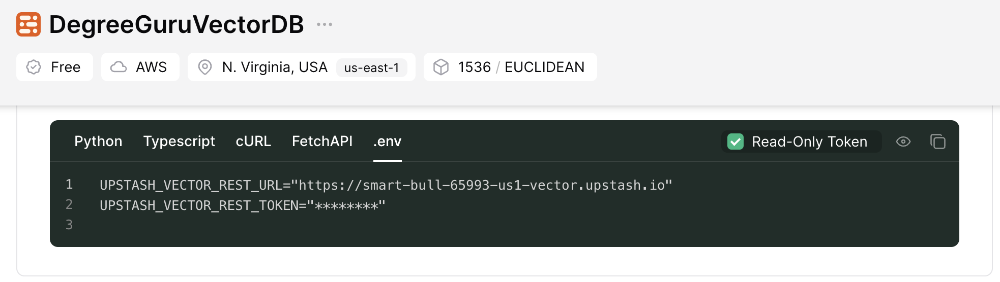
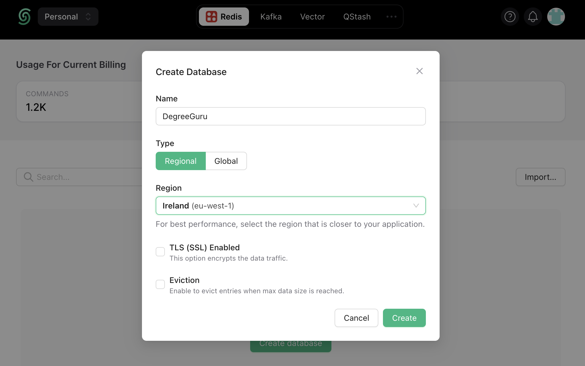

# DegreeGuru

DegreeGuru is an innovative chatbot project designed to effortlessly integrate a chatbot into any web project, enabling seamless question-answering functionality within an hour. The project includes a configurable crawler that meticulously traverses the target website, indexing its contents into an Upstash Vector Database. This database becomes the backbone for the chatbot, allowing it to swiftly retrieve relevant context when users pose questions.

Upon receiving a user query, the chatbot leverages the Upstash Vector Database to deliver accurate responses utilizing streaming with Vercel AI. Additionally, Upstash rate limiting is employed to control access, preventing excessive queries from a particular IP address.

The project employs OpenAI embeddings during both the web crawling phase and the user query embedding process. OpenAI models play a crucial role in generating responses by utilizing the relevant context retrieved from the Upstash Vector Database.

Despite its name, DegreeGuru is not limited to any specific domain; it is domain-agnostic. The chatbot can proficiently answer questions from any topic, provided the information is appropriately stored in the vector database. The only domain-specific aspect lies in the crawler settings, which are configurable in the crawler.yaml file and geared towards universities. The chatbot underwent testing by crawling a university website, with a refined denied keyword list ensuring that pages containing specific words in their URLs are excluded from the crawling process.

The versatility of the DegreeGuru project extends beyond crawling university websites. It can effortlessly be employed to crawl any website, creating a comprehensive vector database that can then be utilized to deploy the chatbot for diverse applications.

## Overview


## Stack

- Crawler: [scrapy](https://scrapy.org/)
- Chatbot App: [Next.js](https://nextjs.org/)
- Vector DB: [Upstash](https://upstash.com/)
- LLM Orchestration: [Langchain.js](https://js.langchain.com)
- Generative Model: [OpenAI](https://openai.com/), [gpt-3.5-turbo-1106](https://platform.openai.com/docs/models)
- Embedding Model: [OpenAI](https://openai.com/), [text-embedding-ada-002](https://platform.openai.com/docs/guides/embeddings)
- Text Streaming: [Vercel AI](https://vercel.com/ai)
- Rate Limiting: [Upstash](https://upstash.com/)

## Quickstart

Before doing anything, we recommend commencing by forking this repository on GitHub and subsequently cloning it for local development. Execute the following command to clone the repository:
```
git clone git@github.com:[YOUR_GITHUB_ACCOUNT]/DegreeGuru.git
```

As outlined in the project description, it comprises two primary components: the crawler and the chatbot. Naturally, our initial focus will be on elucidating how the crawler facilitates the creation of an Upstash Vector Database from any given website. In instances where a vector database is already available, the crawler stage can be bypassed.

### Crawler

The crawler is developed using Python, wherein a Scrapy project is initialized, and a custom spider is implemented. The spider is equipped with a callback function, invoked each time the spider visits a webpage. This callback function performs the task of segmenting the text on the webpage into chunks, generating embeddings for each chunk, and subsequently upserting the vectors into the Upstash Vector Database. Alongside the vectors representing the text, the chunk's text and the website URL are transmitted to the database as metadata.

To execute the crawler, follow the steps outlined below:

<details>

<summary>Configure Environment Variables</summary>
Before initiating the crawler, it is essential to configure environment variables. These variables serve the purpose of enabling text embedding with OpenAI and facilitating the transmission of vectors to the Upstash Vector Database.

If you don't have an Upstash Vector Database already, create one by setting 1536 as the vector size to match the [text-embedding-ada-002](https://platform.openai.com/docs/guides/embeddings) model.




Set the following environment variables:
```
# UPSTASH VECTOR DB
UPSTASH_VECTOR_REST_URL=****
UPSTASH_VECTOR_REST_TOKEN=****

# OPENAI KEY
OPENAI_API_KEY=****
```


</details>

<details>
<summary>Install Required Python Libraries</summary>

To install the libraries, we suggest setting up a Python virtual environment. Before starting the installation, navigate to the `degreegurucrawler` directory.

To setup a virtual environment, first install `virtualenv` package:
```bash
pip install virtualenv
```
Then, create a new virtual environment and activate it:
```bash
# create environment
python3 -m venv venv

# activate environment
source venv/bin/activate
```
Finally, use the `requirements.txt` to install the required libraries:
```bash
pip install -r requirements.txt
``` 

</details>

Upon configuring the environment variables and establishing the virtual environment, you are on the verge of launching the crawler. The subsequent step involves configuring the crawler itself, primarily accomplished through the 'crawler.yaml' file located in the `degreegurucrawler/utils` directory. Additionally, it is imperative to address a crucial setting within the `settings.py` file.

<details>
<summary>Configuring the Crawler Through `crawler.yaml`</summary>

The crawler.yaml has two main sections: `crawler` and `index`:

```yaml
crawler:
  start_urls:
    - https://www.some.domain.com
  link_extractor:
    allow: '.*some\.domain.*'
    deny:
      - "#"
      - '\?'
      - about
index:
  openAI_embedding_model: text-embedding-ada-002
  text_splitter:
    chunk_size: 1000
    chunk_overlap: 100

```

Under the `crawler` section, there are two sections:
`start_urls`: denotes a list of urls which are the urls our crawler will start searching from
`link_extractor`: denotes a dictionary which will be passed as arguments to [`scrapyscrapy.linkextractors.LinkExtractor`](https://docs.scrapy.org/en/latest/topics/link-extractors.html). Some important parameters are:
`allow`: Only extracts links which match the given regex(s)
`allow_domains`: Only extract links which match the domain(s)
`deny`: Deny links which match the given regex(s)

Under the `index` section, there are two sections:
`openAI_embedding_model`: embedding model to use
`test_splitter`: denotes a dictionary which will be passed as arguments to [`langchain.text_splitter.RecursiveCharacterTextSplitter`](https://api.python.langchain.com/en/latest/text_splitter/langchain.text_splitter.RecursiveCharacterTextSplitter.html)

</details>

<details>
<summary>Configuring Depth Through `settings.py`</summary>

`settings.py` file has an important setting `DEPTH_LIMIT` which determines how many consecutive link our spider can crawl. Set a value too high, the spider will visit the deepest corners of the website. Set a value too low, the crawl will end before visiting relevant pages.

Scrapy logs the url of a page when it stops crawling it because of the depth limit. Since this results in a lot of logs, we disabled this debug log. To enable it back, simply remove the `"scrapy.spidermiddlewares.depth"` from the `disable_loggers` in `degreegurucrawler/spider/configurable.py` file.
</details>

When you finish configuring the crawler, you are finally ready to run it to create the Upstash Vector Database! Run the following command to run the crawler:

```
scrapy crawl configurable --logfile degreegurucrawl.log
```

Note that this will take some time. You can observe the progress by looking at the log file `degreegurucrawl.log` or from the metrics in the dashboard of your Upstash Vector Database. If you want to do a dry run (simply crawl the website without generating embeddings), you can achieve this by simply by commenting the line out where we pass the `callback` parameter when initializing the `Rule` object in `ConfigurableCrawler`

### ChatBot

Before running the ChatBot locally, we need to set the environment variables as shown in the `.env.local.example`. To start off, copy the example to the actual file we will update:

```bash
cp .env.local.example .env.local
```

`UPSTASH_VECTOR_REST_URL` and `UPSTASH_VECTOR_REST_TOKEN` are needed to access the Upstash Vector Database. Here, we can use the read-only tokens provided by Upstash since we only need to query the vector database.



`UPSTASH_REDIS_REST_URL` and `UPSTASH_REDIS_REST_TOKEN` are needed for rate-limiting based on IP address. In order to get these secrets, go to Upstash dashboard and create a Redis database



Finally, set the `OPENAI_API_KEY` environment variable to embed user queries and to generate a response.

Once the environment variables are set, DegreeGuru is finally ready to wake up and share its wisdom with the whole world. Simply run to run DegreeGuru web application to interact with the chat bot:

```bash
npm run dev
```

The web application will tpyically be available at http://localhost:3000/, unless stated otherwise in the console where `npm run dev` was run.

The chat bot can be configured to work in two modes:
- streaming mode: Response of the generative model is streamed to the web application as they are generated by the model. Interaction with the app is more fluid.
- non-streaming mode: Response of the generative model is shown to the user when the generation is finished. Model takes longer to respond but in this mode DegreeGuru can explicitly provide the urls of the webpages it used as context.

<details>
<summary>Changing Streaming Mode</summary>
To change enable/disable streaming, simply navigate to `src/app/route/guru` directory and open `route.tsx` file. Setting `returnIntermediateSteps` to `true` disabled streaming while setting it to `false` enables streaming.`
</details>

## Shortcomings

The project has a few shortcomings we can mention:

- UpstashVectorStore extends the LangChain vector store but it is not a complete implementation. It only implements the `similaritySearchVectorWithScore` method which is needed for our agent. Once the vector store is properly added to LangChain, this project can be updated with the new vector store.
- When the non-streaming mode is enabled, message history causes an error after the user enters another query.
- Our sources are available as urls in the Upstash Vector Database but we are not able to show the sources explicitly in the streaming mode.